> **DEPRECATED** — Superseded by client/MILESTONE_1_ARCHITECTURE.md. Retained for historical context.

# Kuwboo System Architecture

**Created:** January 27, 2026
**Last Updated:** January 27, 2026
**Version:** 1.0

---

## Executive Summary

Kuwboo is a multi-platform social/marketplace application with native iOS and Android mobile apps backed by AWS cloud infrastructure. The architecture follows a traditional three-tier pattern with mobile clients communicating via REST API and WebSocket connections to a Node.js backend, which interfaces with an Aurora MySQL database and various AWS services.

---

## High-Level Architecture

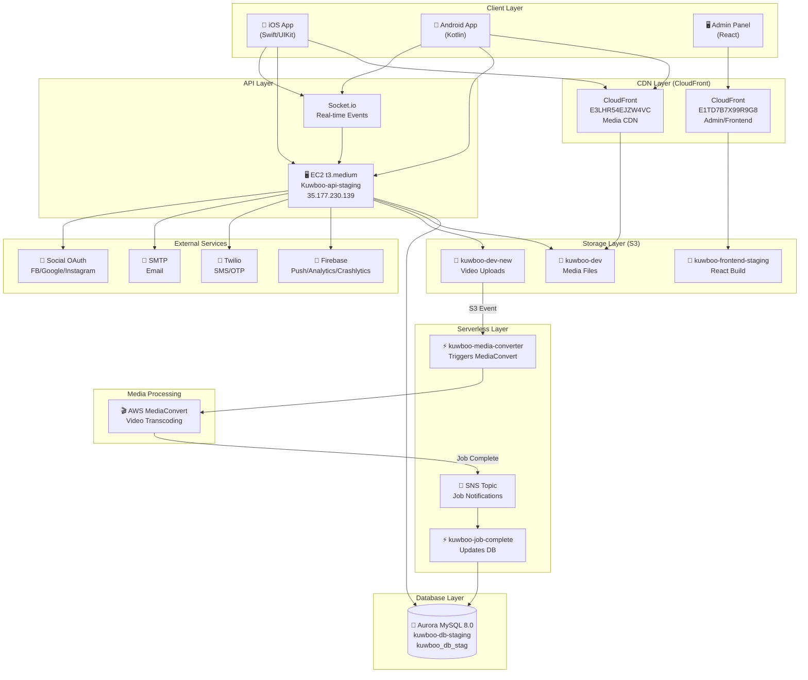

---

## Component Architecture

### Mobile Applications

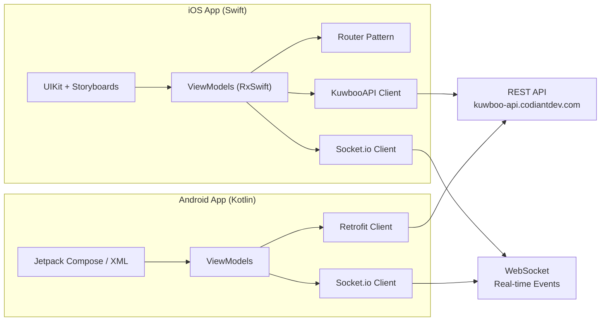

---

### Backend Architecture

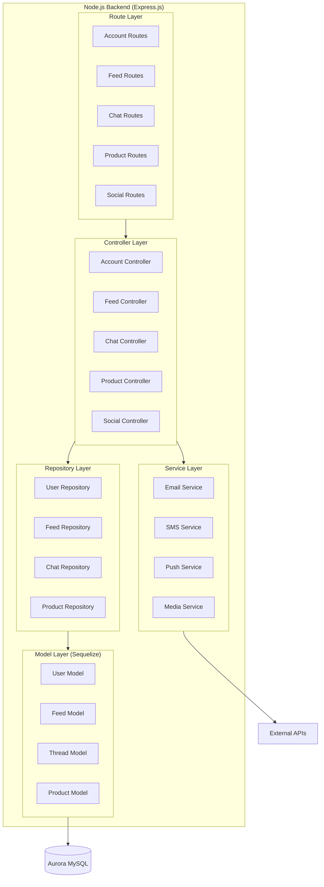

---

### Data Flow Diagrams

#### User Authentication Flow

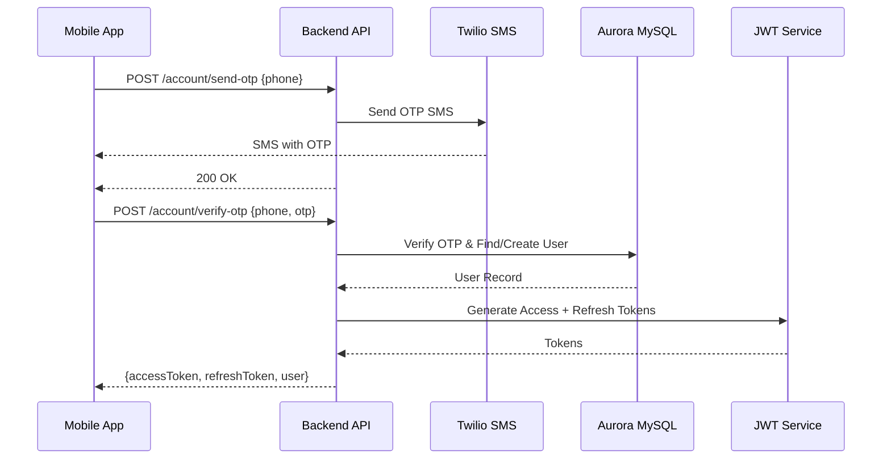

---

#### Video Upload & Processing Flow

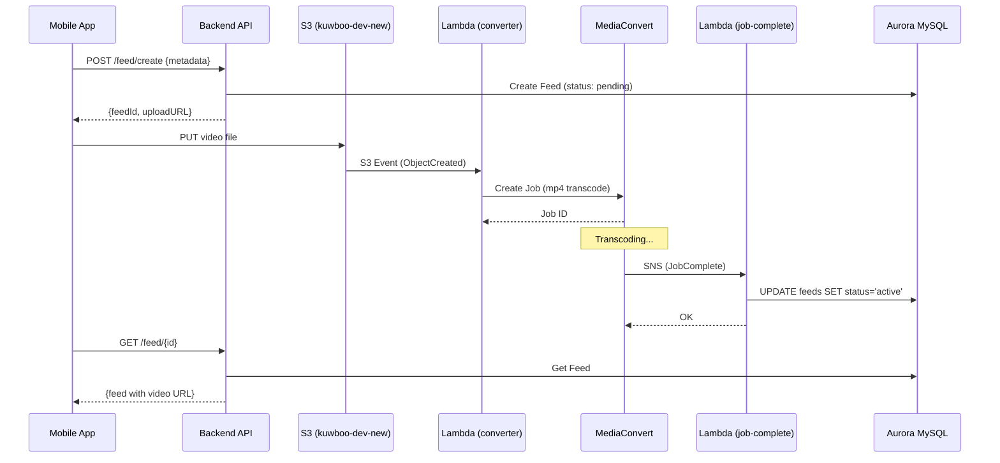

---

#### Real-time Chat Flow

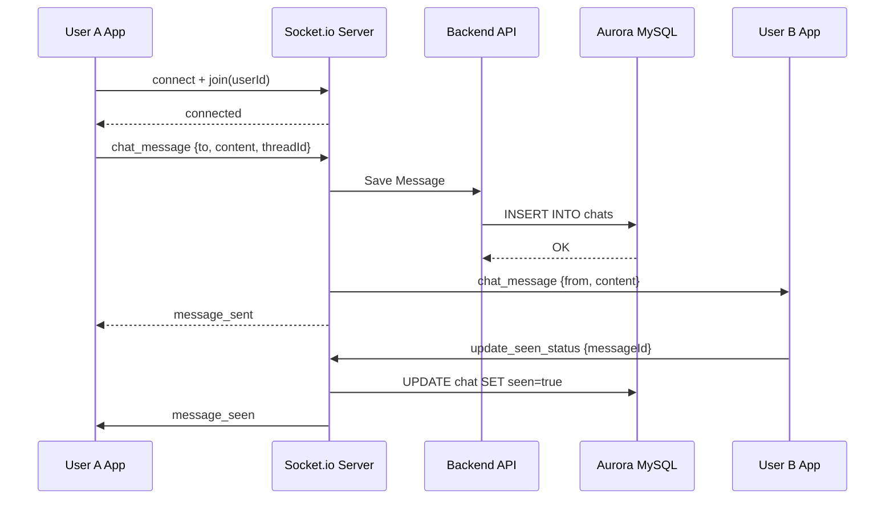

---

### Module Architecture

Kuwboo uses a **module key pattern** where shared infrastructure serves multiple feature domains.

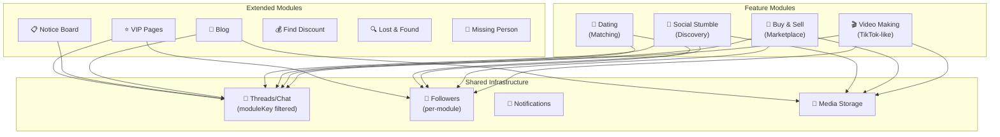

---

### Database Schema Overview

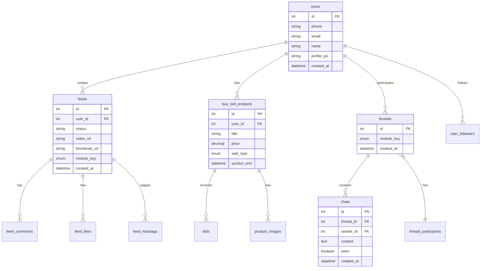

---

### AWS Infrastructure Map

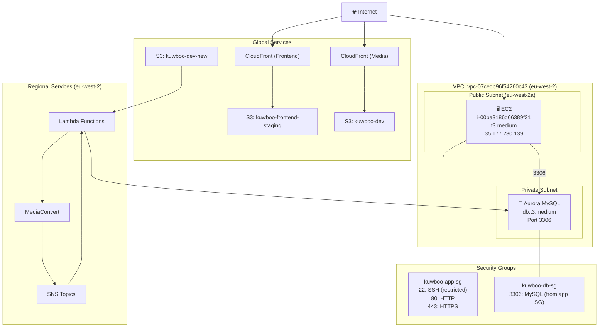

---

## Technology Stack

### Backend

| Component | Technology | Version |
|-----------|------------|---------|
| Runtime | Node.js | ~14.x |
| Framework | Express.js | 4.17.1 |
| ORM | Sequelize | 5.22.0 |
| Database | MySQL | 8.0 (Aurora) |
| Real-time | Socket.io | 2.4.1 |
| Auth | Passport.js | 0.4.1 |
| Validation | Joi | 15.1.1 |
| Logging | Winston | 3.3.3 |

### iOS App

| Component | Technology | Version |
|-----------|------------|---------|
| Language | Swift | 5.0 |
| UI Framework | UIKit + Storyboards | - |
| Architecture | MVVM + Router | - |
| Reactive | RxSwift | 6.9.0 |
| Networking | URLSession | - |
| Image Loading | Kingfisher | 7.6.2 |
| Auth | GoogleSignIn | 5.0.2 |
| Push | Firebase Messaging | 11.15.0 |

### Android App

| Component | Technology | Version |
|-----------|------------|---------|
| Language | Kotlin | - |
| Networking | Retrofit | - |
| Auth | Firebase Auth | - |
| Push | FCM | - |

### AWS Services

| Service | Purpose | Configuration |
|---------|---------|---------------|
| EC2 | API Server | t3.medium |
| Aurora MySQL | Database | db.t3.medium |
| S3 | Media Storage | 3 buckets |
| CloudFront | CDN | 2 distributions |
| Lambda | Video Processing | 2 functions |
| MediaConvert | Video Transcoding | On-demand |
| SNS | Event Notifications | 1 topic |

---

## Network Architecture

### API Endpoints

| Endpoint | Domain | Purpose |
|----------|--------|---------|
| API | `kuwboo-api.codiantdev.com` | REST API |
| WebSocket | `kuwboo-api.codiantdev.com` | Real-time events |
| Admin | `kuwboo.codiantdev.com` | Admin panel |
| Media CDN | CloudFront | Media delivery |

### Ports & Protocols

| Service | Port | Protocol |
|---------|------|----------|
| API Server | 443 | HTTPS |
| API Server | 80 | HTTP (redirect) |
| WebSocket | 443 | WSS |
| MySQL | 3306 | TCP (internal only) |

---

## Security Architecture

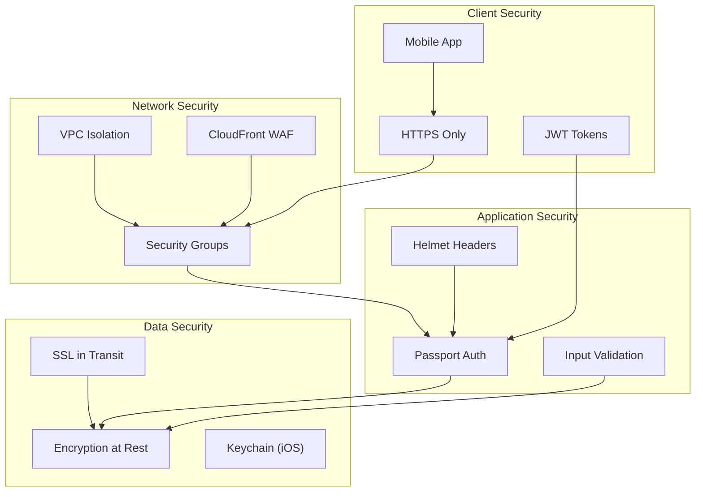

---

## Deployment Architecture

### Current State (Manual)

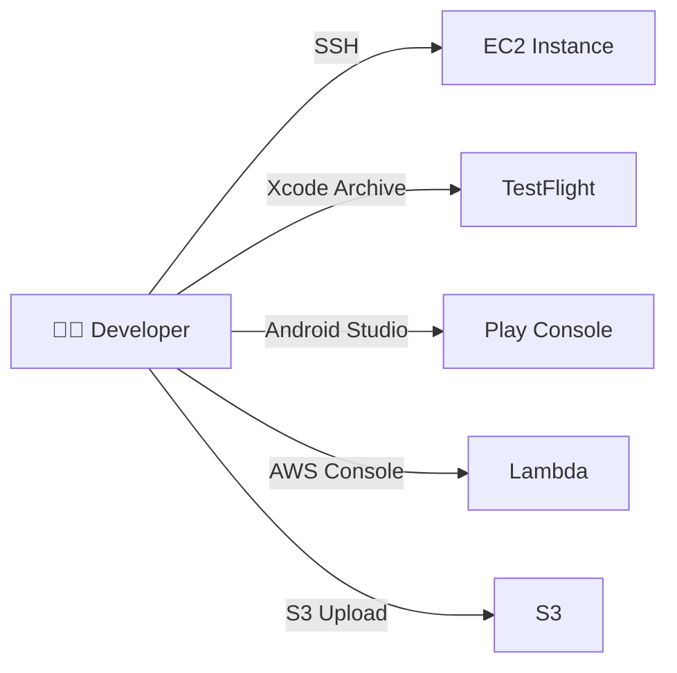

### Target State (CI/CD)

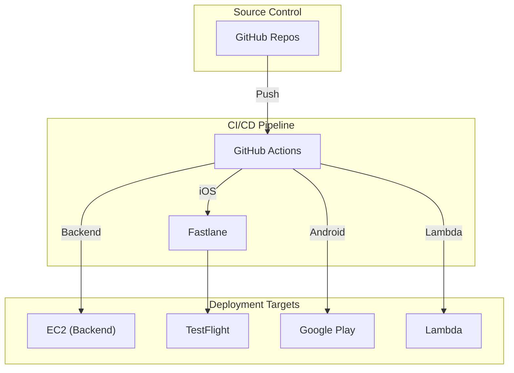

---

## Scalability Considerations

### Current Bottlenecks

| Component | Limitation | Solution |
|-----------|------------|----------|
| EC2 | Single instance | Auto Scaling Group |
| Socket.io | In-memory sessions | Redis adapter |
| Aurora | Single-AZ | Multi-AZ deployment |
| Database | No read replicas | Add read replicas |

### Future Architecture

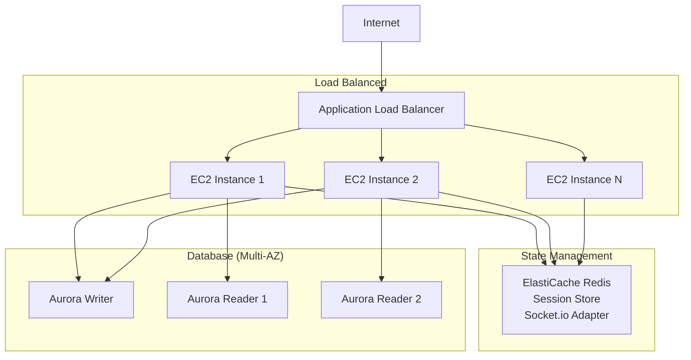

---

## Appendix: Resource Identifiers

### AWS Resource IDs

| Resource | ID |
|----------|-----|
| EC2 Instance | i-00ba3186d66389f31 |
| VPC | vpc-07cedb96f54260c43 |
| Aurora Cluster | kuwboo-db-staging |
| Security Group (App) | sg-0e1f7f0cbec7bb4e2 |
| Security Group (DB) | sg-00e79494db950f4d8 |
| CloudFront (Frontend) | E1TD7B7X99R9G8 |
| CloudFront (Media) | E3LHR54EJZW4VC |
| Lambda (Converter) | kuwboo-media-converter-dev |
| Lambda (Complete) | kuwboo-media-convert-on-job-complete-dev |
| SNS Topic | kuwboo-on-media-convert-job-complete |

### Domains & URLs

| Purpose | URL |
|---------|-----|
| API (Live) | https://kuwboo-api.codiantdev.com |
| Admin Panel | https://kuwboo.codiantdev.com |
| Media CDN | CloudFront distribution URL |

---

**Document Version:** 1.0
**Next Review:** March 31, 2026
