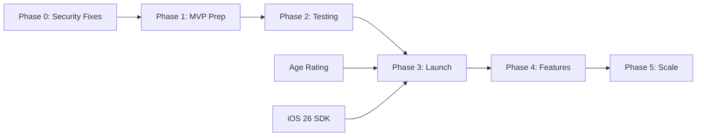

> **DEPRECATED** — Superseded by CONTRACT_KUWBOO_REBUILD.md (contract milestones M1-M6). Retained for historical context.

# Kuwboo Development Roadmap

**Created:** January 27, 2026
**Last Updated:** January 27, 2026
**Version:** 1.0

---

## Executive Summary

This roadmap outlines the phased development plan for bringing Kuwboo from its current state (TestFlight/staging) to production readiness. The plan prioritizes critical security fixes, Apple compliance, and MVP launch before adding secondary features.

### Timeline Overview

| Phase | Duration | Focus | Target Date |
|-------|----------|-------|-------------|
| Phase 0 | 1 week | Critical Fixes | Feb 3, 2026 |
| Phase 1 | 4 weeks | MVP Preparation | Mar 3, 2026 |
| Phase 2 | 4 weeks | Testing & Polish | Mar 31, 2026 |
| Phase 3 | 4 weeks | Production Launch | Apr 28, 2026 |
| Phase 4 | 8 weeks | Feature Expansion | Jun 23, 2026 |
| Phase 5 | Ongoing | Scale & Optimize | Beyond |

---

## Phase 0: Critical Fixes (Week 1)

**Goal:** Eliminate blocking issues and security vulnerabilities

**Duration:** January 27 - February 3, 2026

### Milestone 0.1: Security Fixes

| Task | Owner | Priority | Effort | Status |
|------|-------|----------|--------|--------|
| Fix SQL injection in Lambda | Backend Dev | Critical | 2h | Pending |
| Remove hardcoded test OTP (or gate properly) | Backend Dev | Critical | 30m | Pending |
| Update jsonwebtoken to 9.x | Backend Dev | Critical | 4h | Pending |
| Update axios to 1.6.x | Backend Dev | High | 2h | Pending |
| Rotate all credentials | DevOps | High | 4h | Pending |

**Success Criteria:**
- [ ] Zero critical security vulnerabilities
- [ ] All credentials rotated
- [ ] Backend redeploy successful

### Milestone 0.2: Apple Compliance

| Task | Owner | Priority | Effort | Status |
|------|-------|----------|--------|--------|
| Complete App Store age rating | Product Owner | Critical | 30m | **DUE JAN 31** |
| Verify privacy manifest compliance | iOS Dev | High | 4h | Pending |
| Align deployment targets to iOS 15 | iOS Dev | High | 2h | Pending |

**Success Criteria:**
- [ ] Age rating questionnaire completed
- [ ] No App Store warnings
- [ ] Clean build with iOS 15 target

---

## Phase 1: MVP Preparation (Weeks 2-5)

**Goal:** Prepare the Video-First MVP for TestFlight release

**Duration:** February 3 - March 3, 2026

### Milestone 1.1: Dependency Updates (Week 2)

| Task | Owner | Priority | Effort | Status |
|------|-------|----------|--------|--------|
| Upgrade GoogleSignIn 5.x to 7.x | iOS Dev | High | 8h | Pending |
| Upgrade Sequelize 5.x to 6.x | Backend Dev | High | 8h | Pending |
| Update Socket.io 2.x to 4.x | Backend Dev | Medium | 4h | Pending |
| Update helmet to 7.x | Backend Dev | Medium | 1h | Pending |
| Replace deprecated `request` package | Backend Dev | Medium | 4h | Pending |

**Success Criteria:**
- [ ] All critical dependencies updated
- [ ] No deprecation warnings
- [ ] Full regression testing passed

### Milestone 1.2: UI Simplification (Week 3)

| Task | Owner | Priority | Effort | Status |
|------|-------|----------|--------|--------|
| Hide Buy & Sell module in UI | iOS/Android | High | 4h each | Pending |
| Hide Social Stumble in UI | iOS/Android | High | 2h each | Pending |
| Remove module selection screen | iOS/Android | High | 2h each | Pending |
| Remove Dating, Blog, VIP references | iOS/Android | Medium | 4h each | Pending |
| Simplify navigation to Video-only | iOS/Android | High | 4h each | Pending |

**Success Criteria:**
- [ ] App launches directly to video feed
- [ ] No visible references to other modules
- [ ] Clean user journey tested

### Milestone 1.3: Core Feature Verification (Week 4)

| Task | Owner | Priority | Effort | Status |
|------|-------|----------|--------|--------|
| Test video recording end-to-end | QA | Critical | 8h | Pending |
| Test video upload & processing | QA | Critical | 8h | Pending |
| Test video feed loading | QA | Critical | 4h | Pending |
| Test user authentication flow | QA | Critical | 4h | Pending |
| Test follow/unfollow | QA | High | 2h | Pending |
| Test like/comment | QA | High | 2h | Pending |
| Test push notifications | QA | High | 2h | Pending |
| Test user profile | QA | High | 2h | Pending |

**Success Criteria:**
- [ ] All core user journeys pass
- [ ] Video upload success rate > 95%
- [ ] No critical bugs found

### Milestone 1.4: Security Hardening (Week 5)

| Task | Owner | Priority | Effort | Status |
|------|-------|----------|--------|--------|
| Remove NSAllowsArbitraryLoads | iOS Dev | High | 4h | Pending |
| Add rate limiting to API | Backend Dev | High | 4h | Pending |
| Configure CORS properly | Backend Dev | Medium | 1h | Pending |
| Remove debug print statements | iOS Dev | Medium | 2h | Pending |
| Replace force unwraps | iOS Dev | Medium | 4h | Pending |

**Success Criteria:**
- [ ] No security audit warnings
- [ ] Rate limiting active on auth endpoints
- [ ] HTTPS enforced everywhere

---

## Phase 2: Testing & Polish (Weeks 6-9)

**Goal:** Ensure stability and quality before broader release

**Duration:** March 3 - March 31, 2026

### Milestone 2.1: TestFlight Internal (Week 6)

| Task | Owner | Priority | Effort | Status |
|------|-------|----------|--------|--------|
| Create TestFlight build | iOS Dev | High | 2h | Pending |
| Internal team testing (5-10 users) | QA/Team | High | 40h | Pending |
| Bug triage and prioritization | PM | High | 8h | Pending |
| Fix critical/high bugs | Dev Team | High | Variable | Pending |

**Success Criteria:**
- [ ] Internal TestFlight distributed
- [ ] Bug backlog created
- [ ] No blocking issues

### Milestone 2.2: Performance Optimization (Week 7)

| Task | Owner | Priority | Effort | Status |
|------|-------|----------|--------|--------|
| Profile video feed performance | iOS Dev | Medium | 8h | Pending |
| Optimize image/video loading | iOS Dev | Medium | 8h | Pending |
| Database query optimization | Backend Dev | Medium | 8h | Pending |
| Enable Redis for Socket.io | Backend Dev | Medium | 4h | Pending |

**Success Criteria:**
- [ ] Feed loads in < 2 seconds
- [ ] No memory leaks detected
- [ ] Smooth scrolling (60fps)

### Milestone 2.3: TestFlight External (Weeks 8-9)

| Task | Owner | Priority | Effort | Status |
|------|-------|----------|--------|--------|
| Expand to 50-100 testers | PM | High | 4h | Pending |
| Monitor crash reports | Dev Team | High | Ongoing | Pending |
| Collect user feedback | PM | High | Ongoing | Pending |
| Fix bugs based on feedback | Dev Team | High | Variable | Pending |
| A/B test onboarding flow | PM | Medium | 8h | Pending |

**Success Criteria:**
- [ ] Crash-free rate > 99%
- [ ] User retention D1 > 30%
- [ ] Core feedback addressed

---

## Phase 3: Production Launch (Weeks 10-13)

**Goal:** Launch MVP to App Store

**Duration:** March 31 - April 28, 2026

### Milestone 3.1: Pre-Launch Checklist (Week 10)

| Task | Owner | Priority | Effort | Status |
|------|-------|----------|--------|--------|
| Prepare App Store screenshots | iOS Dev | High | 4h | Pending |
| Write App Store description | PM | High | 4h | Pending |
| Create app preview video | Marketing | Medium | 8h | Pending |
| Register production domain | DevOps | High | 4h | Pending |
| Set up production environment | DevOps | Critical | 8h | Pending |
| Configure production database | DevOps | Critical | 4h | Pending |

**Success Criteria:**
- [ ] All App Store assets ready
- [ ] Production environment tested
- [ ] Domain configured and SSL active

### Milestone 3.2: Infrastructure Preparation (Week 11)

| Task | Owner | Priority | Effort | Status |
|------|-------|----------|--------|--------|
| Set up CI/CD pipeline | DevOps | High | 16h | Pending |
| Configure CloudWatch alarms | DevOps | High | 4h | Pending |
| Set up AWS Backup | DevOps | High | 4h | Pending |
| Enable Multi-AZ for database | DevOps | High | 2h | Pending |
| Load testing (simulated users) | DevOps | Medium | 8h | Pending |

**Success Criteria:**
- [ ] Automated deployments working
- [ ] Monitoring and alerting active
- [ ] Backup/recovery tested
- [ ] System handles 1000+ concurrent users

### Milestone 3.3: App Store Submission (Week 12)

| Task | Owner | Priority | Effort | Status |
|------|-------|----------|--------|--------|
| Final QA pass | QA | Critical | 16h | Pending |
| Version bump and archive | iOS Dev | High | 2h | Pending |
| Submit to App Store Review | iOS Dev | Critical | 2h | Pending |
| Address review feedback (if any) | iOS Dev | Critical | Variable | Pending |

**Success Criteria:**
- [ ] App approved by Apple
- [ ] No review rejections

### Milestone 3.4: Launch (Week 13)

| Task | Owner | Priority | Effort | Status |
|------|-------|----------|--------|--------|
| Release to App Store | PM | Critical | 30m | Pending |
| Monitor launch metrics | Dev Team | Critical | Ongoing | Pending |
| On-call support coverage | Dev Team | Critical | 24/7 | Pending |
| Address critical launch bugs | Dev Team | Critical | Variable | Pending |
| Post-launch retrospective | Team | Medium | 2h | Pending |

**Success Criteria:**
- [ ] App live on App Store
- [ ] No critical production issues
- [ ] First 100 organic downloads

---

## Phase 4: Feature Expansion (Weeks 14-21)

**Goal:** Add secondary features based on user feedback

**Duration:** April 28 - June 23, 2026

### Milestone 4.1: Buy & Sell Module (Weeks 14-17)

| Task | Owner | Priority | Effort | Status |
|------|-------|----------|--------|--------|
| Re-enable Buy & Sell UI | iOS/Android | High | 8h each | Pending |
| Test marketplace flow end-to-end | QA | High | 16h | Pending |
| Add product messaging | Dev Team | High | 8h | Pending |
| Update navigation for dual modules | iOS/Android | High | 4h each | Pending |
| TestFlight with marketplace | QA | High | 40h | Pending |
| App Store update submission | iOS Dev | High | 4h | Pending |

**Success Criteria:**
- [ ] Buy & Sell fully functional
- [ ] Users can list and bid on items
- [ ] Messaging between buyers/sellers works

### Milestone 4.2: Enhanced Features (Weeks 18-21)

| Task | Owner | Priority | Effort | Status |
|------|-------|----------|--------|--------|
| Add video sharing to external apps | iOS/Android | Medium | 8h | Pending |
| Implement content reporting | Backend + Mobile | Medium | 16h | Pending |
| Add hashtag trending page | Backend + Mobile | Medium | 16h | Pending |
| Improve recommendation algorithm | Backend | Medium | 24h | Pending |
| Add user blocking feature | Backend + Mobile | Medium | 8h | Pending |

**Success Criteria:**
- [ ] Enhanced features deployed
- [ ] User engagement improved
- [ ] Content moderation tools active

---

## Phase 5: Scale & Optimize (Ongoing)

**Goal:** Handle growth and improve platform

**Duration:** June 23, 2026 onwards

### Potential Initiatives

| Initiative | Priority | Description |
|------------|----------|-------------|
| Social Stumble re-enable | Medium | Add social discovery module |
| Android parity | High | Ensure feature parity |
| Admin panel rebuild | Medium | Rebuild lost React admin |
| Test coverage | Medium | Target 20% coverage |
| SwiftUI migration | Low | Modernize iOS UI |
| TypeScript migration | Low | Modernize backend |
| Payment integration | Medium | Monetize marketplace |
| Creator monetization | Low | Revenue share for creators |

---

## Resource Requirements

### Development Team

| Role | Count | Phase 0-2 | Phase 3-4 | Phase 5 |
|------|-------|-----------|-----------|---------|
| iOS Developer | 1 | Full-time | Full-time | Part-time |
| Android Developer | 1 | Part-time | Full-time | Part-time |
| Backend Developer | 1 | Full-time | Full-time | Part-time |
| DevOps | 0.5 | Part-time | Full-time | Part-time |
| QA | 0.5 | Part-time | Full-time | Part-time |
| PM | 0.5 | Part-time | Full-time | Part-time |

### Estimated Costs

| Category | Monthly | Notes |
|----------|---------|-------|
| AWS Infrastructure | $150-300 | Scales with users |
| Apple Developer | $8 | $99/year |
| Google Play | $2 | $25 one-time |
| Third-party services | $50 | Twilio, etc. |
| **Development** | Variable | Based on team |

---

## Dependencies

### External Dependencies

| Dependency | Risk | Mitigation |
|------------|------|------------|
| Apple App Review | Medium | Follow guidelines, plan buffer |
| Twilio SMS delivery | Low | Multiple provider fallback |
| AWS availability | Low | Multi-AZ, monitoring |
| MediaConvert | Low | Tested, reliable |

### Internal Dependencies

---

## Risk Mitigation

| Risk | Likelihood | Impact | Mitigation |
|------|------------|--------|------------|
| App Store rejection | Medium | High | Follow guidelines, pre-review |
| Security breach | Low | Critical | Phase 0 security fixes |
| User adoption low | Medium | High | Focus on quality, marketing |
| Technical debt | High | Medium | Incremental refactoring |
| Team availability | Medium | High | Documentation, knowledge sharing |

---

## Decision Points

### Phase 1 Checkpoint

**Date:** March 3, 2026

**Questions to Answer:**
- Is video flow working reliably?
- Are all critical bugs fixed?
- Should we proceed to TestFlight?

### Phase 2 Checkpoint

**Date:** March 31, 2026

**Questions to Answer:**
- Is TestFlight feedback positive?
- Is crash rate acceptable (<1%)?
- Are we ready for production?

### Phase 3 Checkpoint

**Date:** April 28, 2026

**Questions to Answer:**
- Did App Store approval succeed?
- Are production metrics healthy?
- Should we proceed with expansion?

---

## Success Metrics by Phase

### Phase 0-1 Metrics

| Metric | Target |
|--------|--------|
| Security vulnerabilities | 0 critical |
| Build success rate | 100% |
| Test pass rate | >95% |

### Phase 2 Metrics

| Metric | Target |
|--------|--------|
| Crash-free rate | >99% |
| TestFlight users | 50+ |
| D1 retention | >30% |

### Phase 3 Metrics

| Metric | Target |
|--------|--------|
| App Store approval | Yes |
| Launch day downloads | 100+ |
| No critical bugs | 0 |

### Phase 4+ Metrics

| Metric | Target |
|--------|--------|
| Monthly Active Users | 1,000+ |
| D7 retention | >20% |
| Daily videos uploaded | 50+ |
| User feedback rating | 4.0+ |

---

## Appendix: Detailed Task Estimates

### Backend Tasks

| Task | Story Points | Hours |
|------|--------------|-------|
| SQL injection fix | 1 | 2 |
| JWT library update | 2 | 4 |
| Sequelize upgrade | 5 | 8 |
| Socket.io upgrade | 3 | 4 |
| Rate limiting | 2 | 4 |
| CORS configuration | 1 | 1 |
| Redis setup | 3 | 4 |
| CI/CD pipeline | 8 | 16 |
| **Total** | 25 | ~43h |

### iOS Tasks

| Task | Story Points | Hours |
|------|--------------|-------|
| GoogleSignIn upgrade | 5 | 8 |
| Deployment target alignment | 1 | 2 |
| NSAllowsArbitraryLoads removal | 2 | 4 |
| Module hiding | 3 | 8 |
| Debug statement removal | 1 | 2 |
| Force unwrap fixes | 2 | 4 |
| TestFlight preparation | 2 | 4 |
| App Store assets | 2 | 4 |
| **Total** | 18 | ~36h |

### DevOps Tasks

| Task | Story Points | Hours |
|------|--------------|-------|
| Credential rotation | 2 | 4 |
| Production environment | 5 | 8 |
| Domain setup | 2 | 4 |
| CloudWatch alarms | 2 | 4 |
| AWS Backup setup | 2 | 4 |
| Multi-AZ database | 1 | 2 |
| Load testing | 3 | 8 |
| **Total** | 17 | ~34h |

---

## Document History

| Version | Date | Author | Changes |
|---------|------|--------|---------|
| 1.0 | Jan 27, 2026 | LionPro Dev | Initial creation |

---

**Document Version:** 1.0
**Next Review:** February 28, 2026
