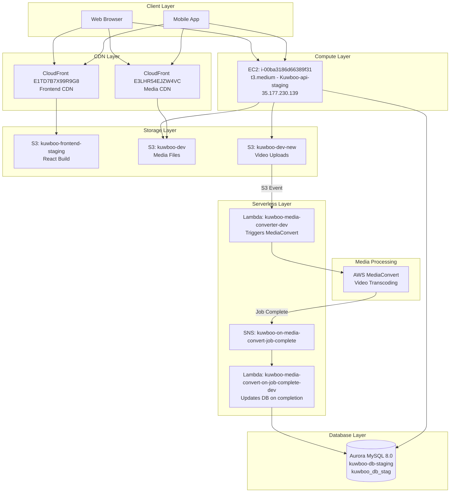

# AWS Infrastructure Audit Report
## Kuwboo Project - Account 166927554624

**Audit Date:** January 25, 2026
**Account Name:** Neil Douglas / Guess This Ltd
**Region:** eu-west-2 (London)
**AWS Profile:** neil-douglas

---

## Executive Summary

### Key Findings

| Category | Status | Notes |
|----------|--------|-------|
| **System Status** | ACTIVE | Recent MediaConvert jobs (Jan 11, 2026) |
| **Monthly Cost** | ~$137/month | Primarily RDS ($126) and EC2 ($61) |
| **SSL Certificate** | VALID | kuwboo.codiantdev.com valid until Oct 2026 |
| **Security** | NEEDS REVIEW | SQL injection in Lambda, IAM cleanup needed |
| **CI/CD** | NOT CONFIGURED | No automated deployment pipelines |
| **Source Code** | RECOVERED | Backend code retrieved from EC2 (530 JS files) |

### Active Infrastructure

- **1** EC2 instance (t3.medium) - Running continuously since Nov 2023
- **1** Aurora MySQL cluster - Production database
- **3** S3 buckets - Media storage and frontend hosting
- **2** Lambda functions - Video processing pipeline
- **2** CloudFront distributions - CDN for frontend and media

### Immediate Recommendations

1. ~~Renew SSL certificate~~ **OK** - Valid until Oct 2026 (us-east-1 cert)
2. **Fix SQL injection vulnerability** in Lambda function
3. ~~Obtain GitHub repository access from previous developer~~ **BYPASSED** - Code recovered from EC2
4. **Review and rotate IAM credentials** for inactive users
5. ~~Enable SSM Session Manager on EC2~~ **PARTIAL** - Policy attached, agent needs install

---

## Architecture Diagram



---

## Infrastructure Inventory

### Compute - EC2

| Property | Value |
|----------|-------|
| **Instance ID** | `i-00ba3186d66389f31` |
| **Name** | Kuwboo-api-staging |
| **Instance Type** | t3.medium (2 vCPU, 4 GB RAM) |
| **Status** | **RUNNING** |
| **Public IP** | 35.177.230.139 |
| **Private IP** | 172.31.5.251 |
| **VPC** | vpc-07cedb96f54260c43 (default) |
| **Subnet** | subnet-00f94bace85b1bfc5 (eu-west-2a) |
| **AMI** | ami-0eb260c4d5475b901 (Ubuntu) |
| **Launch Date** | November 24, 2023 |
| **Key Pair** | kuwboo-eu-west-2-key |
| **Security Group** | kuwboo-app-sg (sg-0e1f7f0cbec7bb4e2) |
| **EBS Volume** | 50 GB gp3 |

**Access Methods:**
- SSH: Available via EC2 Instance Connect (see EC2 Access Recovery section below)
- SSM Session Manager: Policy attached but agent not installed on instance

---

### Database - Aurora MySQL

| Property | Value |
|----------|-------|
| **Cluster ID** | `kuwboo-db-staging` |
| **Status** | **AVAILABLE** |
| **Engine** | Aurora MySQL 8.0.mysql_aurora.3.08.2 |
| **Writer Endpoint** | `kuwboo-db-staging.cluster-cepsv4bfmn1r.eu-west-2.rds.amazonaws.com:3306` |
| **Reader Endpoint** | `kuwboo-db-staging.cluster-ro-cepsv4bfmn1r.eu-west-2.rds.amazonaws.com:3306` |
| **Database Name** | `kuwboo_db_stag` |
| **Master Username** | `admin` |
| **Instance Class** | db.t3.medium |
| **Encryption** | Enabled (AWS managed key) |
| **Backup Retention** | 1 day |
| **Multi-AZ** | No (single instance) |

**Known Tables:**
- `feeds` - Content feed items (columns: `status`, `job_id`)
- `feed_job_queues` - Video processing queue (columns: `status`, `job_id`)

---

### Storage - S3 Buckets

#### kuwboo-dev (Primary Media Storage)
| Property | Value |
|----------|-------|
| **Size** | ~187 MB |
| **Objects** | Media files, package.json, category icons |
| **Last Modified** | November 2023 |
| **Structure** | `public/uploads/video/video-track/` |

#### kuwboo-dev-new (Video Uploads)
| Property | Value |
|----------|-------|
| **Purpose** | Video uploads and thumbnails |
| **Feature** | "social-stumble" functionality |
| **Last Modified** | October 2024 |

#### kuwboo-frontend-staging (React Frontend)
| Property | Value |
|----------|-------|
| **Purpose** | Static website hosting |
| **Content** | Complete React build |
| **Last Modified** | **July 2025** |
| **Backup** | Contains backup from July 2025 |

---

### Serverless - Lambda Functions

#### kuwboo-media-converter-dev

| Property | Value |
|----------|-------|
| **Runtime** | Node.js 16.x |
| **Memory** | 128 MB |
| **Timeout** | 3 seconds |
| **Purpose** | Triggers MediaConvert jobs for video uploads |
| **Trigger** | S3 events from kuwboo-dev-new bucket |

**Code Location:** `docs/lambda/media-converter/index.js`

**How it works:**
1. Receives S3 event when video is uploaded
2. Creates MediaConvert job with custom-mp4 preset
3. Output destination: `s3://kuwboo-dev/public/uploads/video/video-track/`

---

#### kuwboo-media-convert-on-job-complete-dev

| Property | Value |
|----------|-------|
| **Runtime** | Node.js 16.x |
| **Memory** | 128 MB |
| **Timeout** | 3 seconds |
| **Purpose** | Updates database when video processing completes |
| **Trigger** | SNS topic subscription |

**Environment Variables:**
- `DB_HOST` - Aurora cluster endpoint
- `DB_DATABASE` - `kuwboo_db_stag`
- `DB_USERNAME` - Database user
- `DB_PASSWORD` - Database password

**Code Location:** `docs/lambda/job-complete/index.js`

**How it works:**
1. Receives SNS notification from MediaConvert
2. Parses job ID and status from message
3. Updates `feeds.status` to 'active' when job completes
4. Updates `feed_job_queues.status` to 'completed'

**SECURITY WARNING:** Contains SQL injection vulnerability - uses string interpolation instead of parameterized queries.

---

### CDN - CloudFront Distributions

#### E1TD7B7X99R9G8 (Frontend)
| Property | Value |
|----------|-------|
| **Status** | DEPLOYED |
| **Origin** | kuwboo-frontend-staging.s3.amazonaws.com |
| **Purpose** | Serve React frontend application |

#### E3LHR54EJZW4VC (Media)
| Property | Value |
|----------|-------|
| **Status** | DEPLOYED |
| **Origin** | kuwboo-dev.s3.amazonaws.com |
| **Purpose** | Serve media files (videos, images) |

---

### Media Processing - MediaConvert

| Property | Value |
|----------|-------|
| **Endpoint** | `https://pslr5ylta.mediaconvert.eu-west-2.amazonaws.com` |
| **Preset** | `custom-mp4` |
| **Recent Activity** | Jobs processed Jan 4, 8, 11, 2026 |
| **IAM Role** | `khuwboo-media-converter-dev-role-fe43q59h` |

---

### Messaging - SNS

| Topic | Subscriptions |
|-------|---------------|
| `kuwboo-on-media-convert-job-complete` | Lambda: kuwboo-media-convert-on-job-complete-dev |

---

## Security Configuration

### Security Group: kuwboo-app-sg

| Port | Protocol | Source | Purpose |
|------|----------|--------|---------|
| 22 | TCP | 103.83.252.86/32 | SSH (Codiant - previous developer) |
| 22 | TCP | 185.246.209.147/32 | SSH (LionPro Dev - added Jan 25, 2026) |
| 80 | TCP | 0.0.0.0/0 | HTTP |
| 443 | TCP | 0.0.0.0/0 | HTTPS |
| 3306 | TCP | sg-00e79494db950f4d8 | MySQL (security group reference) |

**Assessment:**
- SSH access restricted to specific IPs (good practice)
- HTTP/HTTPS open to public (expected for API server)
- MySQL restricted to security group (good practice)

---

### IAM Users

| User | Created | Last Activity | Purpose |
|------|---------|---------------|---------|
| codiant | Dec 2023 | Unknown | Previous developer |
| kuwboo-s3-dev | Nov 2023 | Unknown | S3 programmatic access |
| kuwboo-dev-s3-new | Feb 2024 | Unknown | S3 programmatic access |
| phil@lionprodev.com | Jan 2026 | Active | Console access |
| philip_cli_tool_24_jan_2026 | Jan 2026 | Active | CLI access (current audit) |

**Recommendations:**
- Audit and potentially deactivate `codiant` user
- Review access keys for all users
- Implement key rotation policy

---

### SSL Certificates

| Domain | Region | Status | Expires |
|--------|--------|--------|---------|
| kuwboo.codiantdev.com | us-east-1 | **VALID** (CloudFront) | Oct 2026 |
| kuwboo.codiantdev.com | eu-west-2 | EXPIRED (unused) | - |

**Note:** CloudFront requires certs in us-east-1. The eu-west-2 cert is stale and can be deleted.

---

## Cost Analysis

### Recent Monthly Costs

| Month | Cost |
|-------|------|
| December 2025 | $137.86 |
| January 2026 (partial) | $102.80 |

### Cost Breakdown by Service

| Service | Monthly Cost | % of Total |
|---------|-------------|------------|
| RDS (Aurora MySQL) | $126.51 | 53% |
| EC2 Compute | $61.27 | 26% |
| Tax | $40.11 | 17% |
| VPC (NAT Gateway/data) | $6.50 | 3% |
| EC2 Other (EBS, snapshots) | $4.85 | 2% |
| S3 | $1.41 | <1% |

### Cost Optimization Opportunities

1. **Database Migration** (see detailed analysis below)
2. **EC2 Reserved Instance**: 1-year commitment could save ~30%
3. **Right-sizing**: Review if t3.medium is necessary
4. **S3 Lifecycle Rules**: Implement for old video files

### Database Cost Analysis

**Current Setup:** Aurora MySQL db.t3.medium = **~$72/month**

This is excessive for a TestFlight/staging application. Aurora is designed for high-availability production workloads with features like:
- 6-way replication across 3 AZs
- 30-second failover
- Up to 15 read replicas

None of these features provide value for a staging environment with minimal users.

#### Option Comparison

| Option | Engine | Instance | Est. Cost | Annual Savings | Migration Effort |
|--------|--------|----------|-----------|----------------|------------------|
| **Current** | Aurora MySQL | db.t3.medium | $72/mo | - | - |
| **Option A** | RDS MySQL | db.t3.micro | $15/mo | **$684/yr** | Low (same engine) |
| **Option B** | RDS PostgreSQL | db.t3.micro | $15/mo | **$684/yr** | Medium (schema changes) |
| **Option C** | Aurora Serverless v2 | Scales to zero | $0-30/mo | **$500-860/yr** | Low (same engine) |

#### Detailed Comparison

| Factor | RDS MySQL | RDS PostgreSQL | Aurora Serverless v2 |
|--------|-----------|----------------|---------------------|
| **Migration effort** | Minimal - same engine, dump & restore | Medium - Sequelize supports both, but needs testing | Minimal - Aurora compatible |
| **Code changes** | None | Update Sequelize dialect, test queries | None |
| **Performance** | Adequate for staging | Adequate for staging | Scales with demand |
| **Future flexibility** | Standard MySQL | Better JSON support, more features | Auto-scales for production |
| **Risk** | Very low | Low-medium | Low |
| **Idle cost** | Fixed ~$15/mo | Fixed ~$15/mo | Near $0 when idle |

#### Recommendation

**For immediate cost savings:** Option A (RDS MySQL db.t3.micro)
- Same engine = zero code changes
- Simple migration via mysqldump
- Saves ~$57/month immediately
- Can always scale up later

**For long-term flexibility:** Option C (Aurora Serverless v2)
- Scales to near-zero when TestFlight app is idle
- Scales up automatically if usage grows
- No instance management
- Best for unpredictable workloads

**Why PostgreSQL might make sense:**
- Industry moving toward PostgreSQL
- Better JSON/JSONB support (useful for feed data)
- More advanced features for future
- Same cost as MySQL
- But: requires code testing, not urgent

#### Migration Path (When Ready)

1. Take Aurora snapshot as backup
2. Create new RDS MySQL db.t3.micro instance
3. Export data: `mysqldump -h [aurora-endpoint] -u admin -p kuwboo_db_stag > backup.sql`
4. Import to new instance: `mysql -h [new-endpoint] -u admin -p kuwboo_db_stag < backup.sql`
5. Update Lambda environment variables with new endpoint
6. Update EC2 application config (requires SSH access)
7. Test thoroughly
8. Delete Aurora cluster

**Prerequisite:** Need EC2 access to update application database configuration.

---

## Architecture Patterns

### Module Key Architecture

Kuwboo uses a **multi-tenant module pattern** where shared infrastructure serves distinct feature modules. This is a key architectural decision that affects all development.

**Core Module Keys** (from `Thread.moduleKey` enum in database):

| Module | Description | Key Tables |
|--------|-------------|------------|
| `video_making` | TikTok-like video feed | feeds, feed_comments, feed_likes |
| `buy_sell` | Marketplace (fixed price + auctions) | buy_sell_products, bids |
| `dating` | Dating/matching profiles | user_match_profiles |
| `social_stumble` | Social discovery feed | social_stumbles |

**Extended Modules** (from `MediaTemp`):
`blog`, `notice-board`, `vip-page`, `find-discount`, `lost-and-found`, `missing-person`

**Implications:**

1. **Shared Chat System** - The `threads` and `chats` tables serve all modules. The `moduleKey` column determines which feature a conversation belongs to.

2. **Module-Specific Followers** - `user_follower_by_modules` table allows users to follow others per-module (e.g., follow someone's videos but not their marketplace listings).

3. **Separate Category Taxonomies** - Each module has its own category table:
   - `video_categories` (27 categories)
   - `buy_sell_categories` (54 hierarchical categories)
   - `blog_categories` (30 categories)
   - `notice_board_categories`

4. **Query Considerations** - Most queries must filter by `moduleKey` to return module-appropriate results.

See `docs/DATABASE_SCHEMA.md` for full table and category documentation.

---

## Technology Stack

### Backend (from package.json)

| Category | Technology |
|----------|------------|
| **Framework** | Express.js 4.17.1 |
| **Database** | MySQL2 + Sequelize ORM |
| **Authentication** | Passport.js with social providers |
| **Real-time** | Socket.io with Redis adapter |
| **Media Processing** | Sharp (images), FFmpeg (video), AWS MediaConvert |
| **Storage** | AWS S3 (multer-s3) |
| **Push Notifications** | FCM (Android), APN (iOS) |
| **Email** | Nodemailer |
| **API Documentation** | Swagger |
| **Logging** | Winston |
| **Scheduling** | node-schedule |

### Social Authentication Providers
- Facebook (passport-facebook-token)
- Google (passport-google-token)
- Instagram (passport-instagram-token)
- Twitter (passport-twitter-token)

### Frontend
- React (served from S3/CloudFront)
- Last updated: July 2025

---

## Access Status

### Recovered (Jan 25, 2026)

| Item | Status | Location |
|------|--------|----------|
| EC2 SSH Access | AVAILABLE | Via EC2 Instance Connect |
| Backend Codebase | RECOVERED | `backend/kuwboo-api/` (530 JS files) |
| Database Credentials | RECOVERED | In `.env` file from backend |
| Application Config | RECOVERED | Full environment variables available |

### Still Pending

| Item | Status | Impact |
|------|--------|--------|
| **Admin Panel Source** | NOT AVAILABLE | React source code not on EC2 or S3, only compiled build exists |
| GitHub Repository | Pending from Codiant | No git history for backend |
| Original SSH Key | Not obtained | Using EC2 Instance Connect instead |

**Admin Panel Gap:** The admin panel at `kuwboo.codiantdev.com` is a React app. Only the compiled/minified build exists in S3. The source code was never deployed to the server - it was built locally by Codiant and uploaded directly. To modify the admin panel, we would need to either:
1. Request source from Codiant
2. Reverse-engineer from minified JS (not practical)
3. Rebuild from scratch

### Public Website / Home Page

**No public website exists.** The app is mobile-first with no marketing site.

| URL | Status | Notes |
|-----|--------|-------|
| `kuwboo.com` | ❌ Domain doesn't exist | Placeholder in code |
| `www.kuwboo.com` | ❌ Not set up | Referenced in Android privacy policy link |
| `admin.kuwboo.com` | ❌ Not set up | Placeholder in CORS config |

The `codiantdev.com` subdomains are the only live URLs. Production domains were never purchased/configured.

### Not Configured (AWS)

| Item | Impact |
|------|--------|
| SSM Session Manager | Agent not installed (policy attached but not active) |
| CI/CD Pipelines | No automated deployments |
| CloudWatch Alarms | No monitoring alerts |
| AWS Backup | No automated backup solution |

---

## Remaining Gaps Summary

### Critical (Security)

| Gap | Description | Effort |
|-----|-------------|--------|
| **Credential Rotation** | All secrets exposed to Codiant, must rotate | Medium |
| **SQL Injection** | Lambda `job-complete` has injectable query | Low |
| **IAM User Cleanup** | Deactivate `codiant` user | Low |

### Critical (Missing Code)

| Gap | Description | Effort |
|-----|-------------|--------|
| **Admin Panel Source** | React source not available, only compiled build in S3 | High (rebuild) |

### High (Operational)

| Gap | Description | Effort |
|-----|-------------|--------|
| **Database Costs** | Aurora $72/mo → RDS $15/mo possible | Medium |
| **No CI/CD** | Manual deployments only | High |
| **No Monitoring** | No CloudWatch alarms configured | Medium |

### Medium (Best Practices)

| Gap | Description | Effort |
|-----|-------------|--------|
| **SSM Agent** | Not installed on EC2, limits access options | Low |
| **No Backups** | AWS Backup not configured | Medium |
| **Code Quality** | Hardcoded values, no tests, callback patterns | High |

### Low (Nice to Have)

| Gap | Description | Effort |
|-----|-------------|--------|
| **Git History** | Backend has no git history (recovered from server) | N/A |
| **Documentation** | API documentation incomplete | Medium |

### Documentation Complete

| Item | Status |
|------|--------|
| Infrastructure inventory | ✅ Complete |
| Architecture diagram | ✅ Complete |
| EC2 access procedure | ✅ Complete |
| Credential locations | ✅ Complete |
| Feature comparison (iOS/Android) | ✅ Complete |
| Mobile codebase assessment | ✅ Complete |
| Cost analysis | ✅ Complete |

### EC2 Access Recovery (Completed Jan 25, 2026)

**Problem:** Original SSH key `kuwboo-eu-west-2-key` not available from previous developer.

**Solution:** Used EC2 Instance Connect to push temporary SSH key without instance restart.

#### Steps Taken

1. **Attempted SSM Session Manager** (failed)
   - Attached `AmazonSSMManagedInstanceCore` policy to `kuwboo-ec2-role-staging`
   - SSM agent was not installed/running on the instance
   - Policy left attached for future use if agent is installed

2. **Used EC2 Instance Connect** (successful)
   ```bash
   # Push temporary SSH key (valid for 60 seconds)
   aws ec2-instance-connect send-ssh-public-key \
     --instance-id i-00ba3186d66389f31 \
     --instance-os-user ubuntu \
     --ssh-public-key file://~/.ssh/lion.pub \
     --availability-zone eu-west-2c
   ```

3. **Updated Security Group**
   - Original SSH restricted to Codiant IP only: 103.83.252.86/32
   - Added LionPro Dev IP: 185.246.209.147/32
   ```bash
   aws ec2 authorize-security-group-ingress \
     --group-id sg-0dab0cbeddd314a81 \
     --protocol tcp \
     --port 22 \
     --cidr 185.246.209.147/32
   ```

4. **SSH Access Established**
   ```bash
   ssh ubuntu@35.177.230.139
   ```

5. **Backend Code Retrieved**
   - Located at `/home/ubuntu/kuwboo-api/` on server
   - Downloaded via SCP: 530 JavaScript files
   - Now stored locally at `backend/kuwboo-api/`
   - Also found: DB dumps at `/home/ubuntu/kuwboo_db_stag.sql` (30MB)

#### Current Access Configuration

| Component | Status | Details |
|-----------|--------|---------|
| IAM Policy | `AmazonSSMManagedInstanceCore` attached | Ready if SSM agent installed |
| Security Group | LionPro Dev IP whitelisted | 185.246.209.147/32 on port 22 |
| SSH Method | EC2 Instance Connect | Push key before each connection |

#### How to SSH (Future Reference)

```bash
# 1. Push your SSH key (valid for 60 seconds)
aws ec2-instance-connect send-ssh-public-key \
  --instance-id i-00ba3186d66389f31 \
  --instance-os-user ubuntu \
  --ssh-public-key file://~/.ssh/lion.pub \
  --availability-zone eu-west-2c \
  --profile neil-douglas

# 2. SSH immediately after
ssh -i ~/.ssh/lion ubuntu@35.177.230.139
```

**Note:** If your IP changes, update the security group:
```bash
# Remove old IP
aws ec2 revoke-security-group-ingress \
  --group-id sg-0dab0cbeddd314a81 \
  --protocol tcp --port 22 --cidr OLD_IP/32 \
  --profile neil-douglas

# Add new IP
aws ec2 authorize-security-group-ingress \
  --group-id sg-0dab0cbeddd314a81 \
  --protocol tcp --port 22 --cidr NEW_IP/32 \
  --profile neil-douglas
```

---

## Services Not In Use

The following AWS services have no resources configured:

- API Gateway (REST/HTTP)
- Cognito User Pools
- ECS/ECR Containers
- ElastiCache
- Elastic Beanstalk
- Amplify
- DynamoDB
- CodePipeline/CodeBuild/CodeCommit
- Route53 Hosted Zones
- Secrets Manager
- SSM Parameter Store
- Elastic Load Balancers
- AWS Backup

---

## Code Quality Assessment

**Note:** This assessment is based on the Lambda function code retrieved from AWS. The main backend codebase on EC2 has not been reviewed due to access limitations.

### Overall Rating

| Aspect | Rating | Comment |
|--------|--------|---------|
| **Security** | Poor | SQL injection vulnerability present |
| **Reliability** | Fair | Works but has race conditions |
| **Maintainability** | Poor | Hardcoded values, inconsistent style |
| **Error Handling** | Poor | Logs errors but doesn't handle gracefully |
| **Modern Practices** | Poor | Callback patterns, no TypeScript, no tests visible |

### Lambda: kuwboo-media-converter-dev

**Purpose:** Triggers MediaConvert jobs when videos are uploaded

| Issue | Severity | Description |
|-------|----------|-------------|
| Inconsistent indentation | Low | Mix of tabs/spaces, no consistent formatting |
| Hardcoded values | Medium | Bucket name, MediaConvert endpoint, IAM ARN should be environment variables |
| Mixed async patterns | Low | Uses async/await but also callbacks (outdated style) |
| No input validation | Medium | Trusts `event.key` exists without checking |
| No error context | Medium | Catches errors but doesn't provide useful context for debugging |

### Lambda: kuwboo-media-convert-on-job-complete-dev

**Purpose:** Updates database when video processing completes

| Issue | Severity | Description |
|-------|----------|-------------|
| **SQL Injection** | **CRITICAL** | Uses string interpolation directly in SQL query |
| Async/callback mismatch | High | Function may exit before query completes due to improper await |
| No connection pooling | Medium | Creates new DB connection per invocation (inefficient) |
| No transaction | Medium | Two UPDATE statements could partially fail, leaving inconsistent state |
| Fragile cleanup | Medium | `connection.end()` in callback not guaranteed to run |
| Typo in code | Low | "Connectced" instead of "Connected" in log message |

### Technical Debt Summary

**Must Fix (Before any production use):**
1. SQL injection vulnerability - parameterize all queries
2. Async handling - ensure queries complete before function exits

**Should Fix (During active development):**
3. Move hardcoded values to environment variables
4. Add input validation
5. Implement connection pooling for Lambda
6. Add proper error handling with context
7. Use transactions for related updates

**Nice to Have:**
8. Consistent code formatting (ESLint/Prettier)
9. TypeScript for type safety
10. Unit tests

### Implications for Main Codebase

If the Lambda code quality is representative of the main backend:
- Expect similar security issues (SQL injection, input validation)
- Likely hardcoded configuration values
- Probably no automated tests
- May have inconsistent error handling

**Recommendation:** Plan for a security audit and code cleanup phase once full codebase access is obtained.

---

## Credential Rotation Checklist

**Status:** PENDING - All credentials should be rotated since Codiant has access.

**Credential File Location:** `backend/kuwboo-api/.env` (local repo only, never push to remote)

| Credential | Service | Priority | Rotation Method |
|------------|---------|----------|-----------------|
| `DB_PASSWORD` | Aurora MySQL | HIGH | RDS console → Modify → Master password |
| `AWS_ACCESS_KEY_ID` / `AWS_SECRET_ACCESS_KEY` | S3/AWS services | HIGH | IAM console → Create new key → Delete old |
| `JWT_SECRET` / `JWT_REFRESH_SECRET` | Auth tokens | HIGH | Generate new random strings, redeploy |
| `TWILIO_ACCOUNT_SID` / `TWILIO_AUTH_TOKEN` | SMS | MEDIUM | Twilio console → API Keys |
| `SMTP_USERNAME` / `SMTP_PASSWORD` | Email | MEDIUM | Email provider console |
| `FIREBASE_PROJECT_ID` | Push notifications | LOW | May need new Firebase project |
| `AUDIO_BLOCK_PUBLICKEY` / `AUDIO_BLOCK_PRIVATEKEY` | Storyblocks API | LOW | Storyblocks dashboard |

**After Rotation:**
1. Update `backend/kuwboo-api/.env` locally
2. SSH to EC2 and update `/var/www/html/kuwboo-api/.env`
3. Restart PM2: `pm2 restart kuwboo-api`
4. Update Lambda environment variables (for DB credentials)
5. Test all affected functionality

---

## Security Issues

### Critical: SQL Injection Vulnerability

**Location:** `kuwboo-media-convert-on-job-complete-dev` Lambda function

**Current Code (VULNERABLE):**
```javascript
const sqlQuery = `UPDATE feeds SET status='active' WHERE job_id='${jobId}';`;
```

**Recommended Fix:**
```javascript
const sqlQuery = `UPDATE feeds SET status='active' WHERE job_id=?`;
connection.query(sqlQuery, [jobId], function(err, result) { ... });
```

### Low: Stale ACM Certificate

An expired certificate exists in eu-west-2 but is not in use. CloudFront uses a valid cert from us-east-1. The eu-west-2 cert can be deleted to avoid confusion.

### Low: IAM User Cleanup

Consider deactivating `codiant` user if no longer needed.

---

## Recommendations

### Immediate (This Week)

1. **SSL Certificate**: Renew expired certificate for kuwboo.codiantdev.com
2. **SQL Injection**: Fix vulnerability in Lambda function
3. **GitHub Access**: Follow up on repository access request

### Short Term (1-2 Weeks)

4. ~~EC2 Access~~ **DONE** - SSH via EC2 Instance Connect working
5. ~~Database Access~~ **DONE** - Credentials recovered from EC2 `.env`
6. **IAM Audit**: Review and deactivate unused users/keys
7. **Monitoring**: Set up CloudWatch alarms for critical metrics
8. **Code Review**: Audit recovered backend code for security issues

### Medium Term (1 Month)

8. **CI/CD Pipeline**: Implement automated deployment (GitHub Actions recommended)
9. **Backup Strategy**: Configure AWS Backup for Aurora and S3
10. **Cost Optimization**: Evaluate Reserved Instances and right-sizing
11. **Documentation**: Document deployment procedures once access is obtained

---

## Appendix

### File References

| File | Description |
|------|-------------|
| `backend/kuwboo-api/` | Complete backend codebase (530 JS files) |
| `backend/kuwboo-api/.env` | All credentials (DB, AWS, JWT, etc.) |
| `docs/lambda/media-converter/index.js` | Video conversion trigger Lambda |
| `docs/lambda/job-complete/index.js` | Job completion handler Lambda |
| `docs/package.json` | Backend dependencies |
| `docs/FEATURE_COMPARISON.md` | iOS vs Android feature comparison |
| `docs/MOBILE_CODEBASE_ASSESSMENT.md` | Mobile code analysis |

### Useful AWS CLI Commands

```bash
# Set AWS profile
export AWS_PROFILE=neil-douglas

# Check EC2 status
aws ec2 describe-instances --instance-ids i-00ba3186d66389f31

# Check Aurora status
aws rds describe-db-clusters --db-cluster-identifier kuwboo-db-staging

# Check recent MediaConvert jobs
aws mediaconvert list-jobs --endpoint-url https://pslr5ylta.mediaconvert.eu-west-2.amazonaws.com

# View Lambda logs
aws logs tail /aws/lambda/kuwboo-media-converter-dev --follow

# Check monthly costs
aws ce get-cost-and-usage --time-period Start=2026-01-01,End=2026-01-31 --granularity MONTHLY --metrics "UnblendedCost"
```

### Contact Information

| Role | Contact |
|------|---------|
| AWS Account Owner | Neil Douglas (nneildouglas33@hotmail.co.uk) |
| Previous Developer | Codiant (see below) |
| Current Consultant | Phil Cutting (phil@lionprodev.com) |

---

### Previous Developer Details

**Developer:** Vikrant (likely Vikrant K. Jain based on Skype ID)
**Company:** Codiant Software Technologies Pvt. Ltd.

| Contact Method | Details |
|----------------|---------|
| General Email | info@codiant.com |
| Skype | vikrantkjain |
| Phone (US) | +1 309-278-0633 |
| Phone (Canada) | +1-(647) 438-8265 |
| Website | https://codiant.com |
| Contact Page | https://codiant.com/contact-us/ |

**Evidence of Codiant involvement:**
- IAM user `codiant` created December 1, 2023
- Domain `kuwboo.codiantdev.com` uses Codiant's dev subdomain
- SSL certificate for kuwboo.codiantdev.com (now expired)

**Access Request Status:**

| Asset | Status | Notes |
|-------|--------|-------|
| GitHub Repository | PENDING | Nice-to-have for git history, but code recovered |
| EC2 SSH Key | BYPASSED | Using EC2 Instance Connect instead |
| Database Credentials | RECOVERED | Extracted from EC2 `.env` file |
| Source Code | RECOVERED | 530 JS files from `/var/www/html/kuwboo-api/` |

**Resolution (Jan 25, 2026):**
- Backend code recovered directly from EC2 via EC2 Instance Connect
- Full credentials (DB, AWS, JWT, etc.) available in recovered `.env`
- GitHub access no longer critical but would provide git history
- No longer dependent on Codiant cooperation for core codebase

---

*Report generated by AWS Infrastructure Audit - January 25, 2026*
